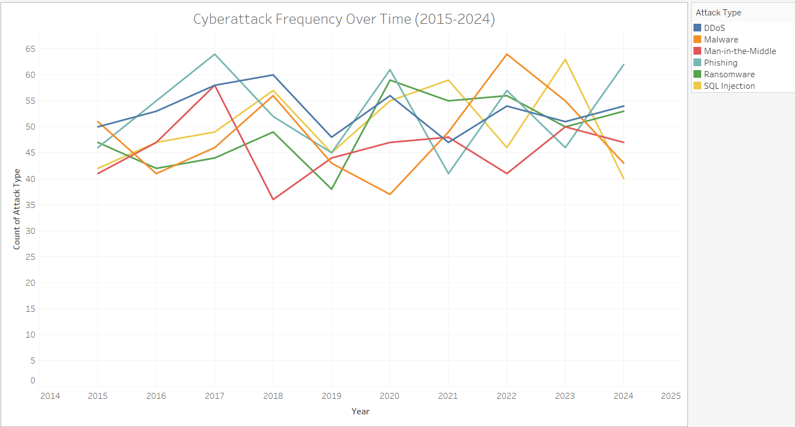
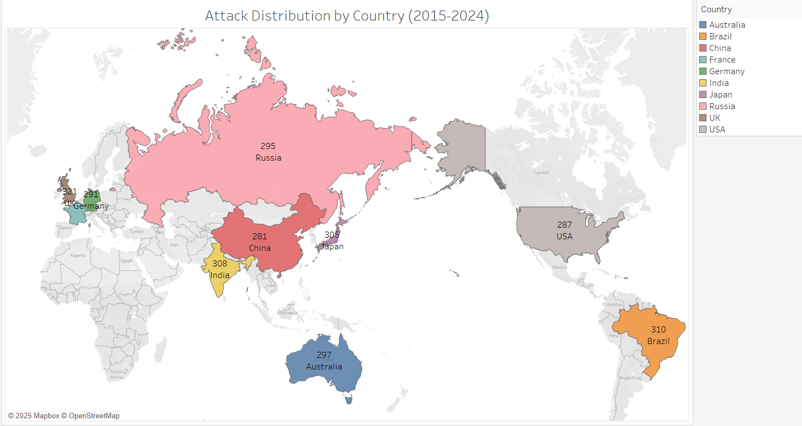
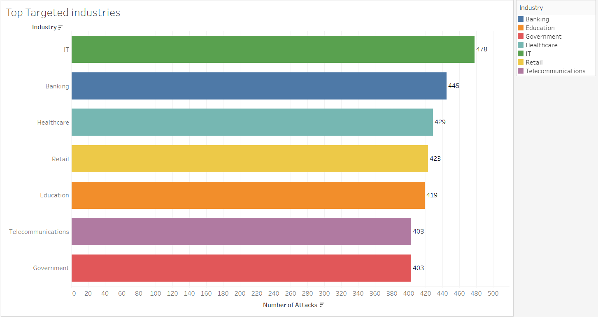
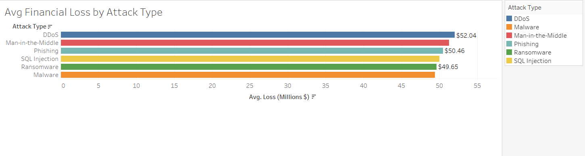
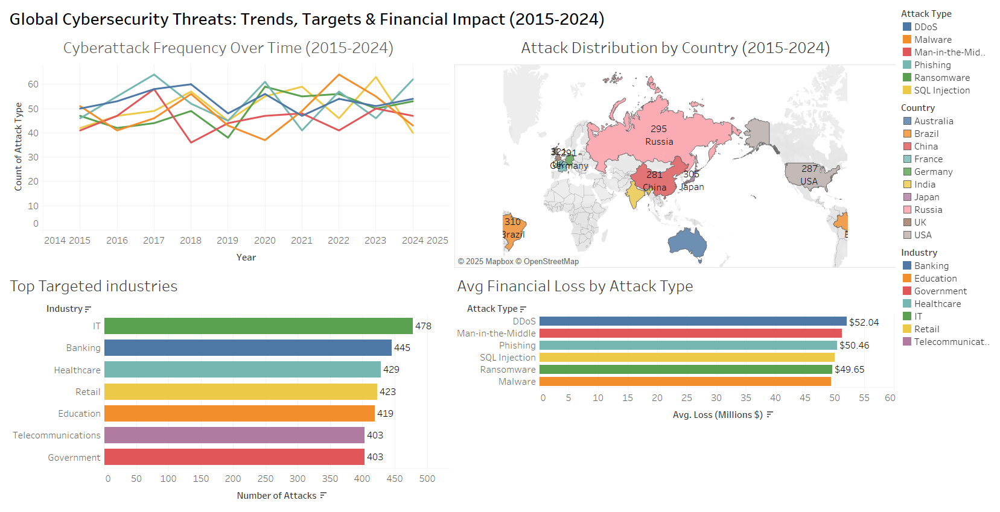

# Global Cybersecurity Threats (2015–2024)

This project explores patterns in global cybersecurity threats using data from 2015 to 2024. The goal was to build a Tableau dashboard that helps stakeholders identify trends in attack frequency, geographic targeting, sector vulnerabilities, and financial impact.

## 🔍 Business Questions Answered
1. **What are the trends in cyberattack frequency over the past 9 years?**
2. **Which countries are most frequently targeted by cyberattacks?**
3. **Which industries are the most frequently targeted by cyberattacks?**
4. **What types of cyberattacks result in the highest financial loss on average?**

## 📊 Tools & Skills Used
- **Tools**: Tableau, Excel  
- **Skills**: Data Cleaning, Visual Analytics, Dashboard Design, Risk Analysis

## 📁 Project Files
- `Cybersecurity_Portfolio_Entry.docx`: Summary report for recruiters
- `Cybersecurity_Training_Manual.docx`: Stakeholder usage guide for dashboard
- `Cybersecurity_Threat_2015_2024_Tableau_Dashboard.twbx`: Tableau dashboard workbook

## 🧠 Key Insights
- **Phishing** attacks surged in 2017; **DDoS** attacks remained consistently high.
- Top targeted countries: **Russia, Brazil, USA, China**
- Most affected industries: **IT, Banking, Healthcare**
- Highest financial losses: **DDoS** and **Man-in-the-Middle** attacks
### 📈 Cyberattack Frequency Trends

### 🌍 Most Targeted Countries

### 🏥 Most Targeted Industries

### 💸 Average Financial Loss by Attack Type

### 🧭 Dashboard Overview

📌 Conclusion
This dashboard reveals significant cybersecurity trends across geography, industry, and attack type between 2015 and 2024.

While Phishing and DDoS remain the most frequent attacks, Man-in-the-Middle and DDoS cause the highest financial damage per incident.

High-risk countries and vulnerable sectors are clearly identified to aid proactive planning.

This analysis enables cybersecurity leaders to prioritize mitigation efforts, allocate security budgets strategically, and adapt to emerging threat patterns with greater confidence.

## 📌 Dataset Source
[Global Cybersecurity Threats (2015–2024) – Kaggle](https://www.kaggle.com/datasets/atharvasoundankar/global-cybersecurity-threats-2015-2024)

## 📅 Completed
July 2025

Add cybersecurity project folder with README
