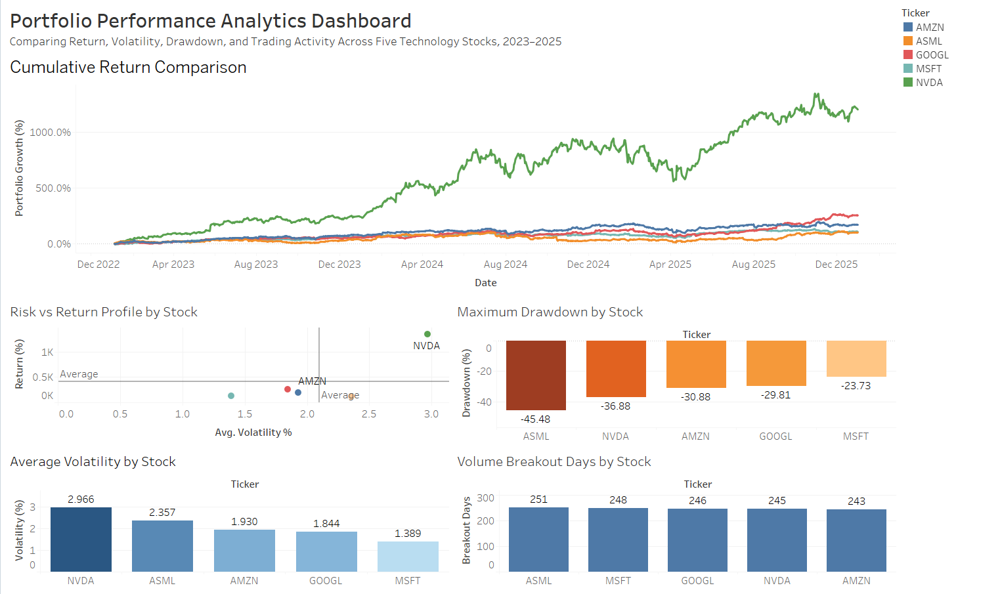

# Portfolio Performance Analytics Dashboard

## Project Overview

This project analyzes the performance of five large-cap technology stocks between January 2023 and December 2025 using Python, PostgreSQL, and Tableau. The goal is to evaluate investment performance through returns, volatility, drawdowns, and trading activity. The project demonstrates a complete analytics workflow, including data collection, feature engineering, database management, SQL analysis, and dashboard visualization.

### Stocks Analyzed

* Microsoft (MSFT)
* ASML Holding (ASML)
* NVIDIA (NVDA)
* Amazon (AMZN)
* Alphabet (GOOGL)

---

## Business Questions

1. Which stock generated the highest cumulative return?
2. Which stock exhibited the highest volatility?
3. Which stock experienced the largest drawdown?
4. Which stock delivered the best balance between risk and return?
5. Which stock experienced the most breakout-volume trading days?

---

## Tools and Technologies

* Python

  * pandas
  * yfinance
* PostgreSQL
* SQL
* Tableau

---

## Data Collection

Historical daily stock market data was collected from Yahoo Finance using the yfinance Python library. The dataset includes:

* Date
* Ticker
* Open Price
* High Price
* Low Price
* Close Price
* Volume

The final dataset contains 3,760 observations across five technology stocks.

---

## Data Preparation

Several analytical metrics were calculated to support investment analysis:

* Daily Return
* Cumulative Return
* 50-Day Moving Average (SMA 50)
* 200-Day Moving Average (SMA 200)
* 21-Day Volatility
* Running Peak Price
* Drawdown Percentage
* Volume Breakout Indicator

---

## Database Design

The processed data was stored in PostgreSQL using a dimensional structure:

### Tables

**company_metadata_dim**

* Company information
* Ticker symbols
* Sector and industry classifications

**portfolio_fact**

* Historical stock prices
* Returns
* Volatility measures
* Drawdowns
* Trading activity metrics

---

## SQL Analysis Results

### Business Question Results

| Metric             | Top Stock |    Value |
| ------------------ | --------- | -------: |
| Highest Return     | NVDA      | 1347.68% |
| Highest Volatility | NVDA      |    2.97% |
| Largest Drawdown   | ASML      |  -45.48% |
| Most Breakout Days | ASML      |      251 |

---

## Tableau Dashboard

The dashboard provides an interactive view of stock performance and risk characteristics.

### Dashboard Components

1. Cumulative Return Comparison
2. Risk vs Return Profile
3. Maximum Drawdown by Stock
4. Average Volatility by Stock
5. Volume Breakout Days by Stock

### Dashboard Preview

---

## Key Findings

* NVIDIA generated the highest cumulative return at 1,347.68%.
* NVIDIA also exhibited the highest average volatility at 2.97%.
* Microsoft demonstrated the lowest volatility at 1.39% and the smallest drawdown at -23.73%.
* ASML experienced the largest drawdown at -45.48%, indicating the greatest downside risk.
* Breakout-volume activity was relatively consistent across all five stocks, ranging from 243 to 251 breakout days.

---

## Project Deliverables

* Python data collection and feature engineering notebook
* PostgreSQL database design and implementation
* SQL business analysis queries
* Interactive Tableau dashboard
* GitHub project documentation

---
